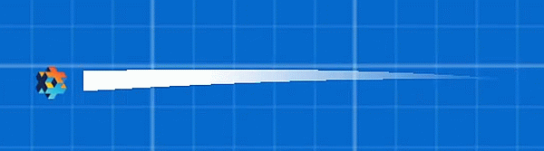

# Hyper Trails

Easy to use and customizable trail effect for the [Defold](https://www.defold.com) game engine.

To draw a trail, Hyper Trails asset creates a buffer, sets the buffer to a mesh, updates the buffer on every frame update.

⚠️ Requires Defold 1.4.3 and newer. 

Feel free to ask questions: [the topic about this asset is on the Defold forum](https://forum.defold.com/t/hyper-trails-customizable-trail-effect/48986).

## Installation

You can use **Hyper Trails** in your own project by adding this project as a [Defold library dependency](http://www.defold.com/manuals/libraries/). Open your `game.project` file and add the links in the dependencies field under project:

* https://github.com/indiesoftby/defold-hyper-trails/archive/master.zip (or point to the ZIP file of a [specific release](https://github.com/indiesoftby/defold-hyper-trails/releases))
* https://github.com/KorolevSoftware/defold-faststream/archive/refs/tags/beta_1.0.zip

## Usage

Using it in your 2D game is simple:

1. Add the components `/hyper_trails/trail_maker.script` and `/hyper_trails/models/trail_mesh.mesh` to your game object.
2. Run your game and move the game object. Enjoy!

## Example App

See the demo game.project for examples of how to use Hyper Trails on its own.

🕹️ [View the demo online](https://indiesoftby.github.io/defold-hyper-trails/) 🕹️

## Settings

`trail_maker.script`'s options:

* `use_world_position` (boolean) - Calculate object movement delta using `go.get_position` or `go.get_world_position`.
* `trail_width` (number)
* `trail_tint_color` (vector4)
* `segment_length_max` (number)
* `segment_length_min` (number)
* `points_count` (number) - any number.
* `points_limit` (number) - Set 0 to use all points (deprecated).
* `fade_tail_alpha` (number)
* `shrink_tail_width` (boolean)
* `shrink_length_per_sec` (number)
* `texture_tiling` (boolean)
* `trail_model_url` (url)
* `auto_update` (boolean) - Uncheck this and send the `update` message to the script instance to manually update the trail.

Change mesh's `texture0` to draw custom texture on the trail.

## Known Issues

### Trail Position Lag

Defold now has such [the update order](https://forum.defold.com/t/go-set-position-lag/47458/10?u=aglitchman) so a trail head position will always be lagging behind for:

1. Physics-based objects (see the picture below).
2. Objects animated using `go.animate()`. 

**Tip:** You can disable the `Auto Update` property for the trail maker instance and check the ` demo/demo_physics.script` how to manually send `update` message to the trail maker script.

**Note:** vote for [https://github.com/defold/defold/issues/7277](the issue).

## Credits

Artsiom Trubchyk ([@aglitchman](https://github.com/aglitchman)) is the current Hyper Trails owner within Indiesoft and is responsible for the open source repository.

### Contributors

* Dmitry Korolev ([@KorolevSoftware](https://github.com/KorolevSoftware)) - rewrote the asset to use buffers and to create buffer resources dynamically in runtime.
* [@vbif1](https://github.com/vbif1) - various bug fixes.

### License

MIT License.
